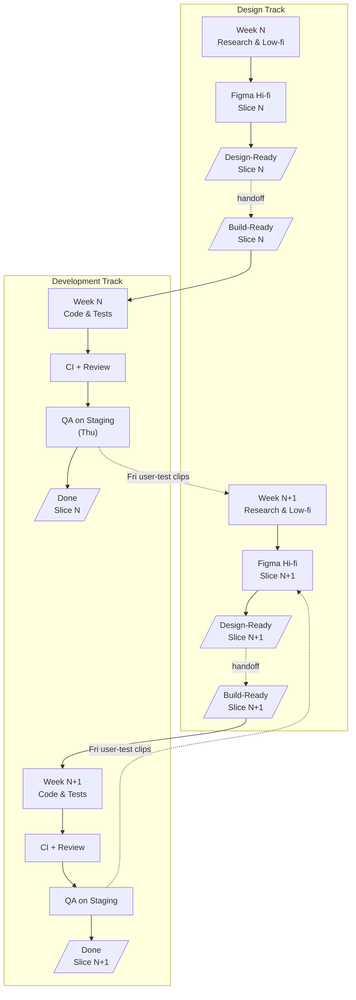

# Nordic Bridge - Cross-Partner Workflow Draft Proposal (v2025-06-06)

## Reading the Workflow Diagram

### 1. Two Side-by-Side “Lanes”
| Lane | Who’s there | What they do |
|------|-------------|--------------|
| **Top lane — Design** | Hólar + AIM | Discover, sketch, and polish one small chunk of the interface (“Slice N”). When finished, they label it **Design-Ready**. |
| **Bottom lane — Development** | LUAS team | Pick only chunks that already have the **Design-Ready** label, turn them into working pages, run checks, put them on the test site, then mark them **Done**. |

---

### 2. Design Always Stays One Chunk Ahead  
While developers build **Slice N**, designers are already preparing **Slice N + 1**.  
Result: builders never wait for new work, and design can change without breaking code already in progress.

---

### 3. Clear “Handoff” Moments  
Dotted arrows show the instant a finished design chunk moves down to the developers.  
No surprise changes after the handoff—updates go into the *next* slice instead.

---

### 4. Developer Quality Steps (Bottom lane)  
1. **Code & Tests** — write the code and its tests.  
2. **Automated Check + Review** — all automatic tests pass and a teammate approves.  
3. **QA on Test Site** — design team clicks through the live test site.  
4. **Done** — the slice is ready for the real product.

---

### 5. Feedback Loop  
*Every Agreed Day* real users try the new slice on the test site.  
Fe. Short video clips of their sessions go straight back to the design lane, guiding next iteration.

## 1 Four Work Streams (run in the same weekly rhythm)

| Stream | Leads | Weekly work | Passes work to… |
|--------|-------|-------------|-----------------|
| **Design** | Hólar + AIM | Tue-Thu: make & polish new screens in Figma; Thu: quick check on test site | **Build** |
| **Build** | LUAS team | Mon: pick “ready” screens; Mon-Fri: turn them into working pages; Fri: show demo on test site | **Pilot** for real-user try-out, **Governance** for checks |
| **Pilot** | BNF + SSNE | Collect 2-3 fresh challenges and 2-3 volunteer users each week; watch Friday demo and log feedback | **Design** (gives new insights) |
| **Governance** | NORD + ATU | Keep privacy, security and open-source paperwork current; hold short clinic every second Wed | Blocks anything that fails the checks |

> **Loop:** *Mon stand-up → Thu design check → Fri demo/test*  
> Design stays **one week ahead** so builders never wait.

---

## 2 Who Delivers What?

| Partner | Weekly contribution |
|---------|--------------------|
| **Hólar** | Latest screens marked “Ready for build” by Thu |
| **AIM** | Colors, text, and accessibility review for those screens |
| **LUAS** | Working pages on the test site with a green “all-good” tick |
| **BNF** | One new business challenge + test volunteer list |
| **SSNE** | One public-sector challenge + feedback notes |
| **NORD** | Privacy / security log updated, no red flags |
| **ATU** | Open-source and funding notes updated |
| **Student unions** | Extra testers when asked |

---

## 3 Simple Boards (fe. in Notion)

* **Story Board:** Idea → Ready for build → In progress → Test site → Done  
* **Challenge Board:** New → Agreed → Built → Archived  
* **Risk Board:** Open → Being fixed → Closed  

---

## 4 Regular Meetings  

### Example for Development Team

* **Mon 09:45** – 15 min stand-up (all stream leads)  
* **Thu 13:00** – 30 min design check on test site (Hólar, AIM, LUAS)  
* **Fri 14:00** – 45 min demo + user-test clips (all partners)  
* **Wed 15:00** every second week – 30 min privacy & security clinic (NORD, LUAS Sr, ATU)  

---

## 5 Quality Gates for Every Screen

1. **Design Gate** – Hólar: screen complete, colours & text final, quick accessibility pass.  
2. **Build Gate** – LUAS: automatic tests green, code reviewed, appears on test site.  
3. **Governance Gate** – NORD: no privacy or security issues logged.  
4. **Pilot Gate** – BNF/SSNE: at least one real user finished the flow; usability score ≥ 75.  

A screen moves to **Done** only when all four gates are green.

* **Designers (Hólar, AIM)** – measured by how many screens hit Design Gate.  
* **Builders (LUAS)** – measured by how many screens pass Build Gate.  
* **Pilot teams (BNF, SSNE, Students)** – measured by fresh challenges and usability scores.  
* **Governance (NORD, ATU)** – measured by keeping gates green and paperwork current.  

Numbers appear on the monthly Steering-Board slide so effort is visible.

---

